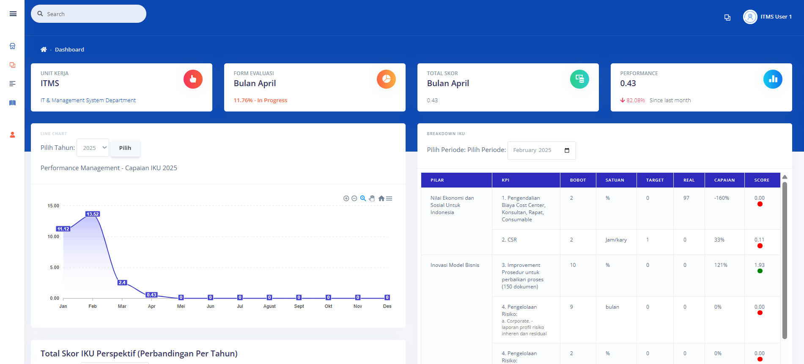
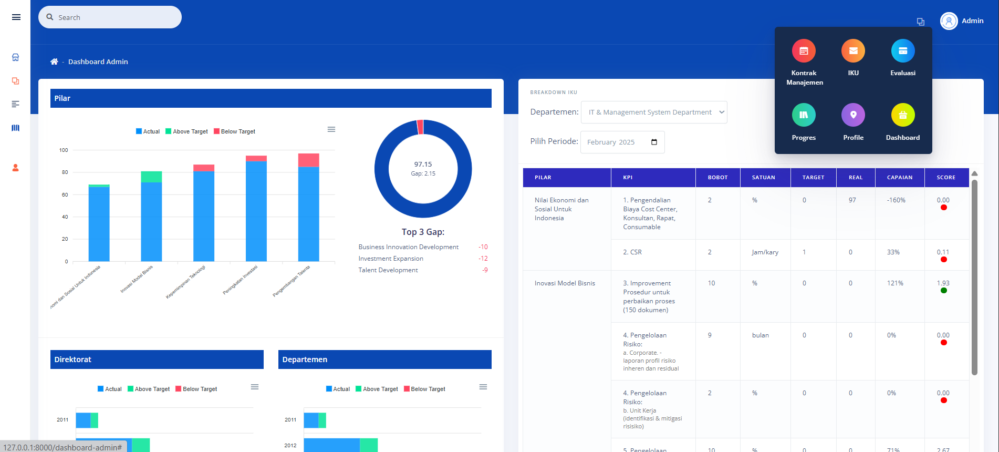
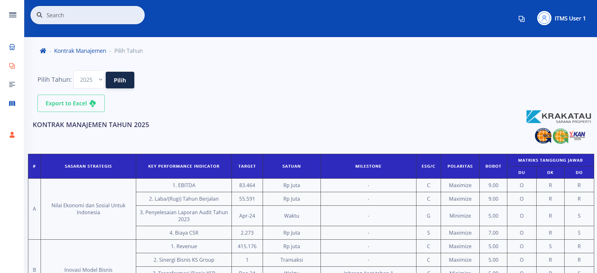
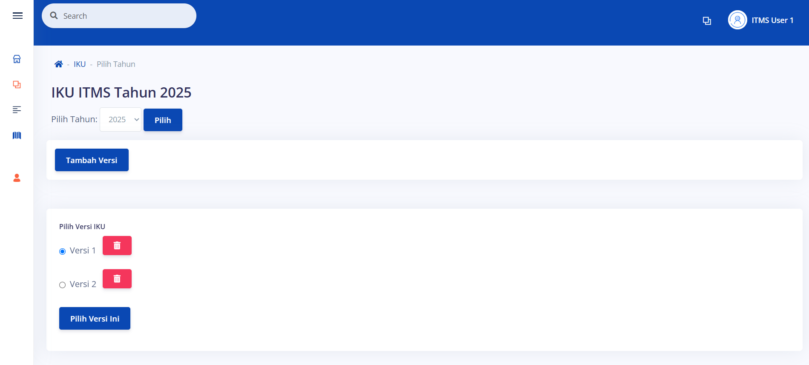
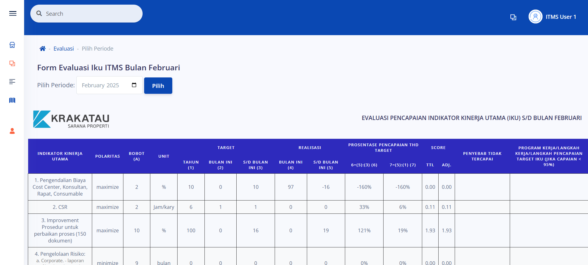
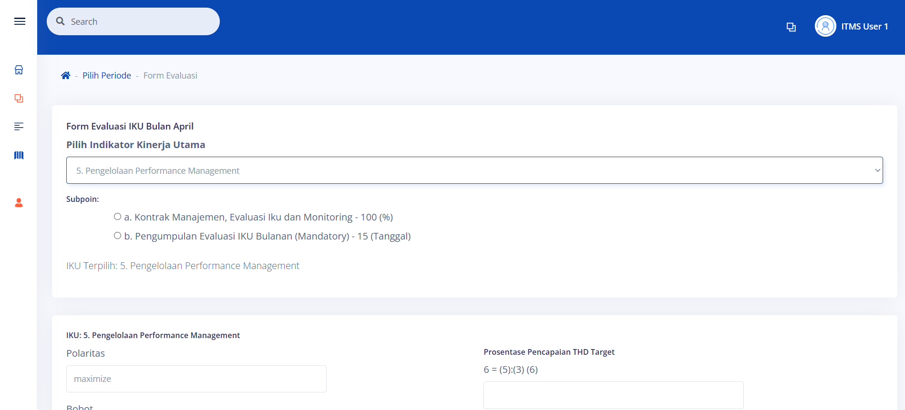
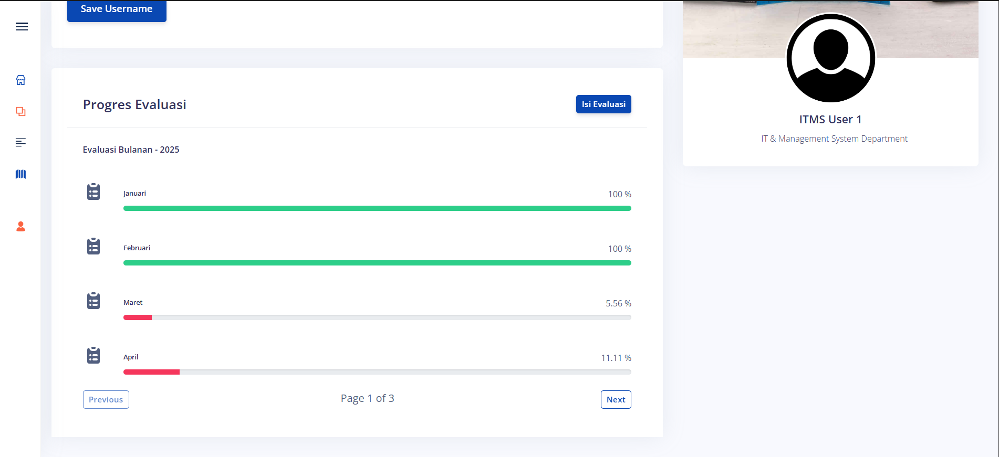

# 📊 Performance Management System – PT. Krakatau Sarana Properti

### 💡 Project Overview

This project is a **Performance Management Website** developed for **PT. Krakatau Sarana Properti**, designed to streamline internal evaluation processes and drive data-informed decision-making. Built with the **Laravel** framework, the platform offers robust tools for managing contracts, tracking KPIs, and visualizing performance metrics across the organization.

---

### 📷 Interface Preview

#### 📋 Main Dashboard  

#### 🧑‍💼 Admin Dashboard  

---

### 🚀 Key Features

#### 📑 Contract Management  

- Create, view, and manage employee or vendor contracts  
- Organize contract terms and status for seamless performance alignment

#### 📌 KPI Tracking  

- Set and monitor **Key Performance Indicators** per department or role  
- Ensure strategic goals are being measured and met

#### 📊 Performance Evaluation  
  

- Submit and review performance evaluations through structured forms  
- Real-time tracking of evaluation progress

#### 🧾 KPI Form Submission  

- Easy-to-use interface for submitting new KPI entries

#### 📈 Data Visualization  
- Interactive graphs and charts for better performance insights  
- Helps identify trends, bottlenecks, and opportunities for growth

#### 👤 Profile Management  

- Users can update their information and monitor personal performance metrics

---

### 🛠️ My Contributions

- **Developed** the web application using Laravel with clean, scalable architecture  
- **Designed and implemented** key pages and workflows  
- **Collaborated** with cross-functional teams  
- Focused on **UX** and **system performance**

---

### 🔧 Technologies Used

- **Framework**: Laravel (PHP)  
- **Frontend**: Blade Templates, Bootstrap, JavaScript  
- **Database**: MySQL  
- **Charting**: Chart.js, Apex Charts  
- **Version Control**: Git & GitHub  

---

### ⚙️ How to Use It

1. Export `admin_web.sql` into your MySQL database  
2. Copy `.env.example` and rename it to `.env`  
3. Run `npm install` and `composer install`  
4. Run `php artisan migrate`  
5. Start the server with `php artisan serve`

### ⚙️ Vendor Used
1. Maatwebsite Excel
2. dompdf

---

### 🌟 Project Values

- ✨ **Creativity & Expression**
- 🔗 **Interdisciplinary Collaboration**
- 🛠️ **Work Ethic & Excellence**

---

### 📈 Future Enhancements

- Role-based access control  
- Automated performance alerts  
- HR/payroll system integration  
- Mobile responsiveness

---

### 🏢 About the Client

**PT. Krakatau Sarana Properti (KSP)** is a leader in **industrial estate management**, providing strategic and integrated property solutions including hotels, waterparks, and business centers, based in **Cilegon City**.
